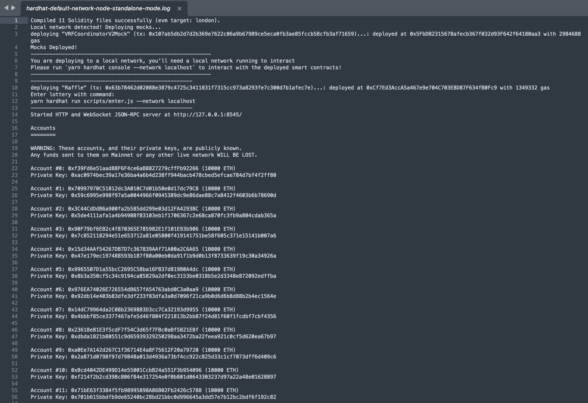
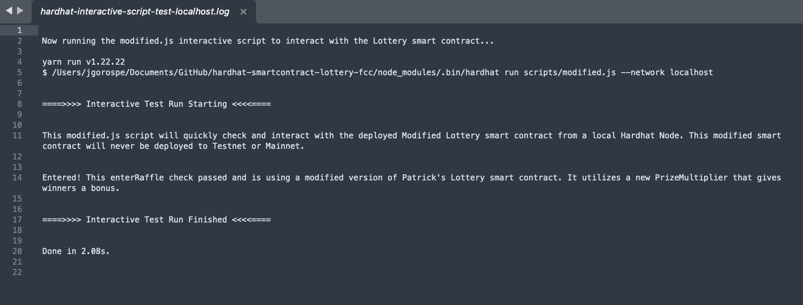

These are my notes while working on [Patrick's Javascript Blockchain/Smart Contract FreeCodeCamp Course](https://www.youtube.com/watch?v=gyMwXuJrbJQ).

- On April 18, 2024 successfully compiled and deployed the following modified "Lottery smart contract" example code using `hardhat deploy` on a locally installed Hardhat fake blockchain node. I used a similar build automation pipeline approach found in my [hardhat-fund-me-fcc](https://github.com/jg8481/hardhat-fund-me-fcc) fork. I also checked the deployed example by using the `modified.js` script





- On April 18, 2024 successfully compiled, deployed, and verified Patrick's original "Lottery smart contract" to the following address on Sepolia Testnet using my own Alchemy Sepolia Testnet RPC. I also checked it with an `enter.js` script by paying the entrance fee.

  - https://sepolia.etherscan.io/address/0x8b378ff69ecc3a0ef48485a10bb501057ccce954#code
  - https://sepolia.etherscan.io/tx/0xf3e0dea141394c3f64419742c116b37654e8b69cf2e41e939f4445ffadda9e35

---
### Technical Requirements

Check the basic technical requirements from Patrick's original GitHub repo. For convenience, MacOS users can run `bash ./Lesson8CodeSessions_start-deployment-scripts.sh Install-Tools-On-MacOS-Or-Linux` from the root of this repo to help quickly install the required tools.

### Quick Start Script

After the basic technical requirements are installed and working, then you can run the `bash ./Lesson8CodeSessions_start-automation-build-pipeline.sh` script. This automation script will start a sequence of the scripts listed below, and is meant to behave like a typical build pipeline.

### Current Toolkit Capabilities
```
You can view just this help menu again (without triggering any automation) by running 'bash ./Lesson8CodeSessions_start-deployment-scripts.sh -h' or 'bash ./Lesson8CodeSessions_start-deployment-scripts.sh -h --help'.

bash ./Lesson8CodeSessions_start-deployment-scripts.sh Stop-Local-Blockchain-Nodes-Clean-Environment
bash ./Lesson8CodeSessions_start-deployment-scripts.sh Install-Tools-On-MacOS-Or-Linux
bash ./Lesson8CodeSessions_start-deployment-scripts.sh Start-Deployment-On-A-Specific-Network hardhat
bash ./Lesson8CodeSessions_start-deployment-scripts.sh Start-Deployment-On-Real-Ethereum-Testnet
bash ./Lesson8CodeSessions_start-deployment-scripts.sh Start-Hardhat-Test
bash ./Lesson8CodeSessions_start-deployment-scripts.sh Start-Interactive-Script-Test enter.js localhost

If you're running this for the first time run the following before running any of these scripts.

bash ./Lesson8CodeSessions_start-deployment-scripts.sh Install-Tools-On-MacOS-Or-Linux

Then you can run the following combined commands in your terminal to deploy the contract to the Hardhat local blockchain node.

bash ./Lesson8CodeSessions_start-deployment-scripts.sh Stop-Local-Blockchain-Nodes && bash ./Lesson8CodeSessions_start-deployment-scripts.sh Start-Deployment-On-A-Specific-Network hardhat
```
